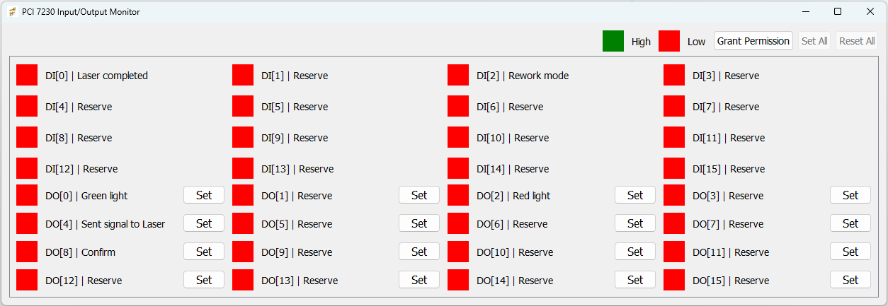
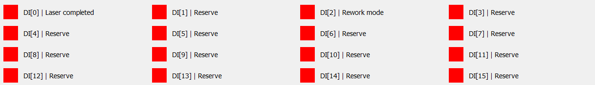
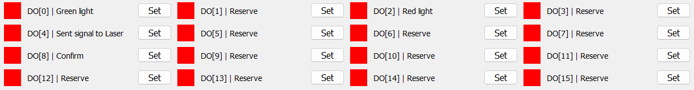
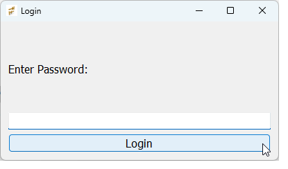
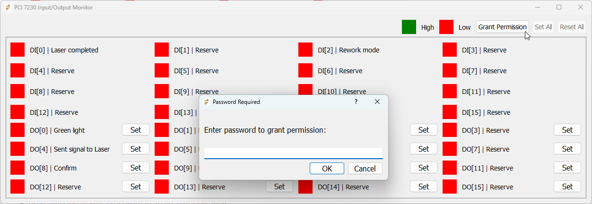

# Monitor-pci-7230
# PCI 7230 Input/Output Monitor

## Contents

- [Monitor-pci-7230](#monitor-pci-7230)
- [PCI 7230 Input/Output Monitor](#pci-7230-inputoutput-monitor)
  - [Contents](#contents)
  - [Overview](#overview)
  - [Features](#features)
    - [1. **Input Monitoring**:](#1-input-monitoring)
    - [2. **Output Control**:](#2-output-control)
    - [3. **Access Control**:](#3-access-control)
      - [1. Login the application:](#1-login-the-application)
      - [2. Grant Permission for modify value (Set/Reset):](#2-grant-permission-for-modify-value-setreset)
    - [4. **GUI Features**:](#4-gui-features)
  - [Prerequisites](#prerequisites)
  - [Installation](#installation)
  - [Usage](#usage)
    - [1. **Running the Application**:](#1-running-the-application)
    - [2. **Login Process**:](#2-login-process)
    - [3. **Monitoring and Controlling**:](#3-monitoring-and-controlling)
    - [4. **Password Management**:](#4-password-management)
  - [Resize/Config Windows](#resizeconfig-windows)
  - [Label IO PINs](#label-io-pins)
    - [For Digital Input:](#for-digital-input)
    - [For Digital Output:](#for-digital-output)
  - [Files and Directories](#files-and-directories)
  - [Known Issues](#known-issues)
  - [License](#license)
  - [Acknowledgments](#acknowledgments)
  - [Contact](#contact)

## Overview

This application provides a GUI to monitor and control the input and output states of a PCI 7230 card. It includes features such as real-time input monitoring, output control, and user authentication for access control.



## Features

### 1. **Input Monitoring**:
   - Displays the real-time state of all 16 digital inputs (DI).
   - Uses color-coded labels: Green for `High` and Red for `Low`.
   - Descriptive labels for certain DI functions (e.g., "Laser completed", "Rework mode").
   

### 2. **Output Control**:
   - Allows toggling the state of all 16 digital outputs (DO).
   - Displays real-time state changes with color-coded labels.
   - Includes "Set All" and "Reset All" functionalities for batch control.
   

### 3. **Access Control**:
#### 1. Login the application:
   - Users must log in with a password to access the application.
   - A secondary password prompt is required for toggling output states.
   

   If users don't want login when run application, Use configuration.xml (config file), focus into tag "LOGIN" and modify value in `ENABLE_PASSWORD_LOGIN` is False, `this only applies when opening the application`: 
   ```xml
   <ENABLE_PASSWORD_LOGIN>False</ENABLE_PASSWORD_LOGIN>
   ```

#### 2. Grant Permission for modify value (Set/Reset):
   - Users must enter a password to access Set/Reset function.
   

### 4. **GUI Features**:
   - Modern and responsive PyQt5-based interface.
   - Color-coded status indicators for better clarity.
   - Scrollable interface for ease of use on smaller screens.

## Prerequisites

- Python 3.6+
- PyQt5 library
- `cryptography` library for password encryption and decryption.
- PCI 7230 card and its corresponding library (`monitor7230.so`).

## Installation

1. Clone or download this repository.
2. Ensure the required libraries are installed:
   ```bash
   pip install PyQt5 cryptography
   ```
   
      ```bash
   pip install beautifulsoup4
   ```

      ```bash
   pip install lxml
   ```
3. Place the PCI 7230 library (`monitor7230.so`) in the root directory of the project.
4. Ensure the `cryptlog.py` module is available for handling encrypted passwords.

## Usage

### 1. **Running the Application**:
   Ubuntu os
   ```bash
   python app.py
   ```

   Windows os (just UI) for test Graphics
   ```bash
   python appw.py
   ```

### 2. **Login Process**:
   - Upon starting, a login window will appear.
   - Enter the admin password to access the main interface.

### 3. **Monitoring and Controlling**:
   - Monitor input states in real-time.
   - Grant permission to toggle outputs by clicking "Grant Permission" and entering the secondary password.
   - Use the "Set All" and "Reset All" buttons to control all outputs simultaneously.

### 4. **Password Management**:
   - Passwords are securely encrypted and stored.
   - Use the `cryptlog.py` utility to manage encrypted login credentials.
   - If you want to change password, use the `cryptlog.py`, follow;
   ```bash
   python cryptlog.py
   ```
   It is recommended that you enter creator and user  as "Admin"


## Resize/Config Windows

Use configuration.xml (config file), focus into tag "SIZE", example:
```xml
<!-- <Name_window> x1,y1,x2,y2 </Name_window -->
<LOGIN_WINDOW>800, 500, 400, 200</LOGIN_WINDOW>  
<PERMISSION_WINDOW>770, 500, 400, 150</PERMISSION_WINDOW>
<MONITOR_WINDOW>350, 300, 1250, 400</MONITOR_WINDOW>
```

## Label IO PINs

Use configuration.xml (config file), focus into tag "IO", example:
### For Digital Input:
```xml
<DI>
   <!-- <PORT function="Function of pin, that mean label" id="pin number" /> -->
   <PORT function="Laser completed" id="0"/>
   <PORT function="Reserve" id="1"/>
   <PORT function="Rework mode" id="2"/>
   <PORT function="Reserve" id="3"/>
   <PORT function="Reserve" id="4"/>
</DI>
```

### For Digital Output:
```xml
<DO>
   <!-- <PORT function="Function of pin, that mean label" id="pin number" /> -->
   <PORT function="Green light" id="0"/>
   <PORT function="Reserve" id="1"/>
   <PORT function="Red light" id="2"/>
   <PORT function="Reserve" id="3"/>
   <PORT function="Sent signal to Laser" id="4"/>
</DO>
```

## Files and Directories

- `app.py`: Main application file.
- `appw.py`: Main application file for test graphics.
- `cryptlog.py`: Module for handling password encryption and decryption.
- `root_lib/monitor7230.so`: PCI 7230 card library.
- `Shortcut/IO_COM.png`: Application icon.
- `login/Admin`: Directory containing encrypted admin credentials.

## Known Issues

1. Ensure `monitor7230.so` is compiled correctly and matches your system architecture.
2. For incorrect or missing password files, the application will display an error message.

## License

This application is provided under the MIT License. See `LICENSE` for more information.

## Acknowledgments

- PyQt5 for GUI development.
- `cryptography` for secure password handling.
- PCI 7230 card library for hardware interfacing.

## Contact

For issues or suggestions, please reach out via the GitHub repository or email the maintainer.

